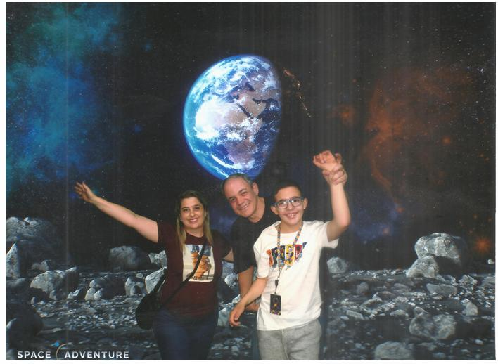

### Quem sou eu?
Olá :-)  
Eu me chamo  
**Flaris Roland Feller**  
Um homem de família  
  
Apaixonado por tecnologia  
Mestre em Ciência da Computação - BD e Big Data  
MBA em Gerenciamento de Projetos  
Graduado em Ciências da Computação  
Pesquisador na UFSC/INE  
Há 29 anos atuando profissionalmente na área da TI  
Atuação em empresas de Florianópolis  
Áreas:  
* Banco de Dados 
* Desenvolvimento 
* Infra

email: flaris.feller@faculdadecesusc.edu.br

